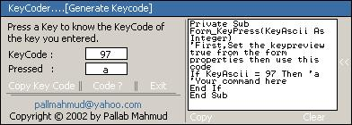



## KeyCoder \[with cool interface \!\]

### Description

This little piece of code returns a keycode from the input.And it can handle a borderless form,I mean drag.It has a cool sliding side bar that shows code how to use keyboard key to establish a command. It has a cool interface.And i think you like it.Anyway,Check it out....
 
### More Info
 

             |
---                |---
**Submitted On**   |2002-06-13 06:09:32
**By**             |[Pallab Mahmud](https://github.com/Planet-Source-Code/PSCIndex/blob/master/ByAuthor/pallab-mahmud.md)
**Level**          |Beginner
**User Rating**    |5.0 (10 globes from 2 users)
**Compatibility**  |VB 5\.0, VB 6\.0
**Category**       |[Coding Standards](https://github.com/Planet-Source-Code/PSCIndex/blob/master/ByCategory/coding-standards__1-43.md)
**World**          |[Visual Basic](https://github.com/Planet-Source-Code/PSCIndex/blob/master/ByWorld/visual-basic.md)
**Archive File**   |[KeyCoder\_\[939256132002\.zip](https://github.com/Planet-Source-Code/pallab-mahmud-keycoder-with-cool-interface__1-35791/archive/master.zip)

